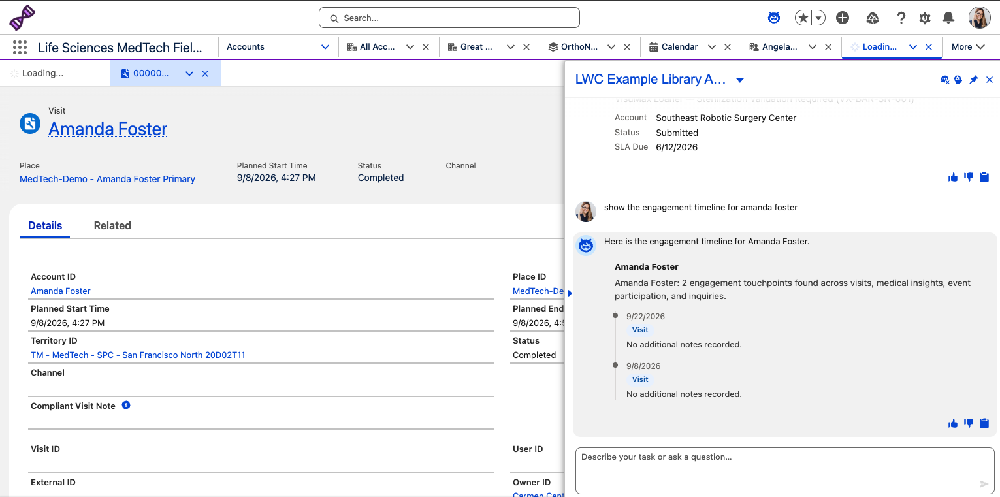
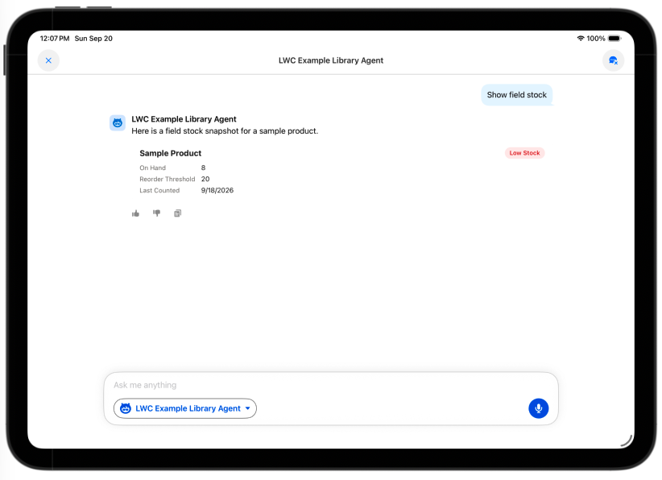
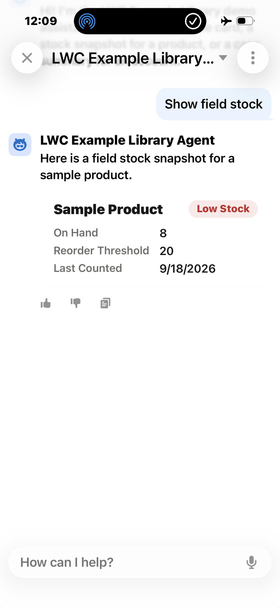

# Testing the Inline LWC Library with a Live Agent

This library ships five example pairs of Custom Lightning Type (CLT) +
inline LWC so you can test each one with real chat utterances instead of
just inspecting code:

| Example | Action | CLT | LWC | Data |
|---|---|---|---|---|
| Template scaffold | `GetSampleAgentforceOutputAction` | `sampleAgentforceOutputCLT` | `sampleAgentforceOutputLWC` | Canned — intentionally, see below |
| Field Stock Snapshot | `GetFieldStockSnapshotAction` | `fieldStockSnapshotCLT` | `fieldStockSnapshotLWC` | Real — live `ProductBatchItem` query |
| Case Escalation Summary | `GetCaseEscalationSummaryAction` | `caseEscalationSummaryCLT` | `caseEscalationSummaryLWC` | Real — live `Case`/`CaseMilestone` query |
| HCP Engagement Timeline | `GetHcpEngagementTimelineAction` | `hcpEngagementTimelineCLT` | `hcpEngagementTimelineLWC` | Real — live query across `Visit`, `MedicalInsightAccount`, `LSDO_Medical_Conference_Activity__c`, `Inquiry` |
| Signature Capture | `GetSignatureCaptureAction` | `signatureCaptureCLT` | `signatureCaptureLWC` | Real — live `Case`/`Pricebook2`/`PricebookEntry`/`Product2` query, plus a client-side `Order`/`OrderItem` write |

## Screenshots: confirmed rendering on Web, iPad, and iPhone

**Web** (HCP Engagement Timeline example):



**iPad**, standard Salesforce Mobile App (Field Stock Snapshot example):



**iPhone**, standard Salesforce Mobile App (Field Stock Snapshot example):




> **Note on iPad/mobile support:** the standard Salesforce Mobile App on iPad
> *does* support rendering inline LWCs from Agentforce chat, but this isn't
> turned on by default — it requires opening a case with Salesforce to have
> it enabled for the org.

Four of the five examples query real Salesforce records live — none
of them fabricate data, and a real query can legitimately return no match
(the card is `null` in that case; see each example's doc for the exact
"no data" behavior). **Signature Capture** is also the library's one
write-capable example: the card itself performs a real `createRecord` DML
call (client-side in the LWC, not a second Agentforce action) to generate
a draft `Order`/`OrderItem` once the rep logs usage and captures a
confirmation signature — see
[`examples/signature-capture.md`](examples/signature-capture.md). Only the
**template scaffold** stays canned: it exists
purely as a generic, duplicable starting point for a new example
(`SampleAgentforceOutputWrapper`'s own doc comment says "duplicate me to
start a new example") and has no natural real-object mapping of its own —
converting it to real data would defeat its purpose as boilerplate.

Because these four now return real, live-org data instead of fixed
values, the utterance → expected-response examples in
[`examples/`](examples/) show a **worked example from a specific test run**,
not a guaranteed reproducible value — the exact numbers/names will drift as
the org's data changes.

This library is intentionally separate from, and does not modify, the real
**Visit Compliance Agent** already live in this org (`GetRecentVisitsAction`,
`RecordVisitNoteAction`, `visitList`, `visitNoteInput`).

## Test user

Use **Carmen Central** — an active, non-admin test user
with the `LS MT Field Sales Representative` profile and the
`LSDO - MedTech Field Sales Rep`, `LSDO - MedTech Field Sales Rep Agent`, and
`LSDO MedTech Field Sales PSG` permission set / group assignments. This is
the closest match to a real field rep persona already provisioned in
the target org, so it exercises the components the way an actual user
would (including the Mobile data path, if tested from the **AFLS custom
mobile app**).

Avoid testing as an admin user only — admin profiles can mask permission
issues a real rep would hit.

**Confirmed working in the standard Salesforce Mobile App on iPad**
(2026-09-20) — see the screenshot in
[`examples/field-stock-snapshot.md`](examples/field-stock-snapshot.md#confirmed-live).

## Test agent: already deployed via Agent Script (no Setup UI needed)

A standalone **LWC Example Library Agent** — deliberately separate from
`LS_MedTech_Field_Sales_Agent` and `Visit_Compliance_Agent` — is defined as
an **Agent Script** (`.agent` file) in
[`force-app/main/default/aiAuthoringBundles/LWC_Example_Library_Agent/`](../force-app/main/default/aiAuthoringBundles/LWC_Example_Library_Agent/LWC_Example_Library_Agent.agent).
Its `inline_lwc_examples` topic wires all five actions above, including the
`complex_data_type_name` binding to each CLT (`c__sampleAgentforceOutputCLT`,
`c__fieldStockSnapshotCLT`, `c__caseEscalationSummaryCLT`,
`c__hcpEngagementTimelineCLT`, `c__signatureCaptureCLT`) and instructs the
planner to always use `show_command` so the card renders instead of
falling back to a text dump.

This whole thing is CLI-deployable — no manual Agent Builder steps required.
To reproduce from scratch:

```bash
# 1. Generate boilerplate (already done — .agent file is hand-edited from here)
sf agent generate authoring-bundle --no-spec \
  --name "LWC Example Library Agent" --api-name LWC_Example_Library_Agent \
  --target-org <target-org> --output-dir force-app/main/default

# 2. Compile the Agent Script and publish Bot/BotVersion/GenAiX metadata to the org
sf agent publish authoring-bundle --target-org <target-org> \
  --api-name LWC_Example_Library_Agent

# 3. Activate — REQUIRED after every publish, not just the first one.
# Each publish creates a new BotVersion (v1, v2, v3...) that stays Inactive
# by default; it does NOT replace whichever version is currently Active.
# Skipping this step means real chat/mobile users keep talking to a stale,
# possibly-broken older version while every local/CLI test looks fine.
sf agent activate --target-org <target-org> --api-name LWC_Example_Library_Agent

# Verify the newest version is actually the Active one (don't just trust
# the activate command's terse/empty output):
sf data query --target-org <target-org> --query \
  "SELECT Id, Status, VersionNumber FROM BotVersion \
   WHERE BotDefinitionId IN (SELECT Id FROM BotDefinition WHERE DeveloperName = 'LWC_Example_Library_Agent') \
   ORDER BY VersionNumber"

# 4. Deploy the access permission set and assign it to the test user
sf project deploy start --target-org <target-org> \
  --source-dir force-app/main/default/permissionsets/LWC_Example_Library_Agent_Access.permissionset-meta.xml
```

Then assign `LWC_Example_Library_Agent_Access` (grants `agentAccesses` on
the bot plus `classAccesses` on all backing Apex classes — see
[`force-app/main/default/permissionsets/LWC_Example_Library_Agent_Access.permissionset-meta.xml`](../force-app/main/default/permissionsets/LWC_Example_Library_Agent_Access.permissionset-meta.xml))
to **Carmen Central**, e.g. via the `afls` MCP's `assign_permission_set`
tool or Setup → **Users** → **Permission Set Assignments**.

Open the agent as Carmen Central, on both **Web** and the **AFLS mobile
app**, and try the utterances in [`examples/`](examples/).

**Note on `sf agent preview`:** `sf agent preview start --authoring-bundle
LWC_Example_Library_Agent --use-live-actions` is useful for quick scripted
testing, but it compiles and runs the **local** `.agent` file directly — it
does NOT hit the published `BotVersion` real users talk to. A passing
`agent preview` result does not prove a fix has reached production; always
confirm the newest `BotVersion` is `Active` (per step 3 above) and retest
in the actual chat widget/app.

## Expected-response format

Each example file lists the exact utterance, which action fires, and a
worked example of the real data it returned during a confirmed live test —
not a fixed/guaranteed value, since the three data-bearing examples now
query real records. `slaDueDate` and `lastCountDate` come from real
`CaseMilestone.TargetDate` / `ProductBatchItem.LastModifiedDate` fields and
can be `null` or absent when the underlying record has no value.
