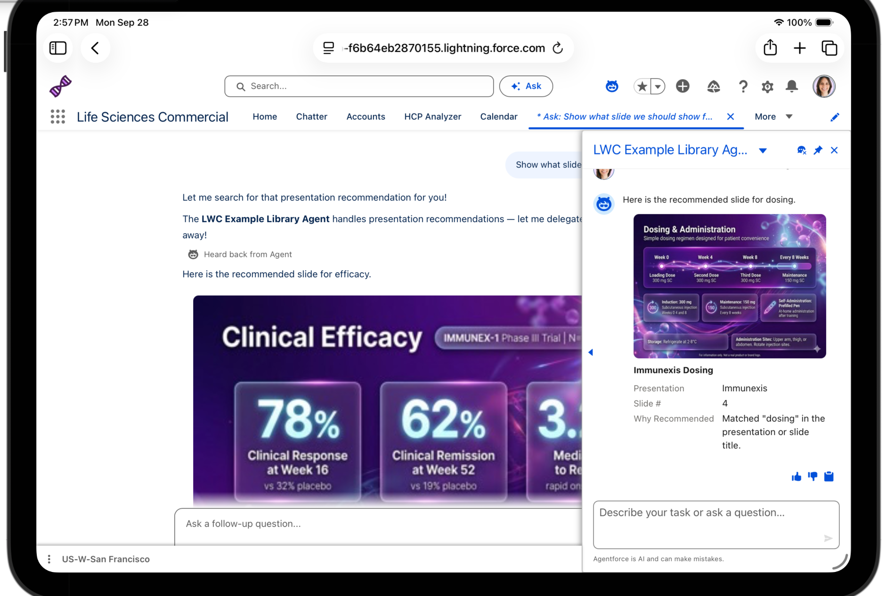
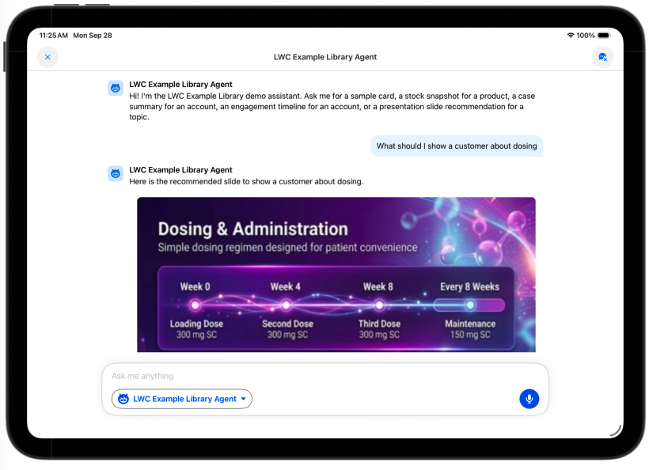
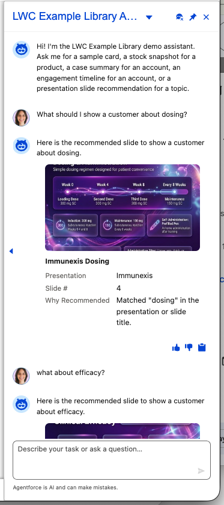

# Example: Presentation Recommendation

Action: `GetPresentationRecommendationAction` · CLT: `presentationRecommendationCLT` · LWC: `presentationRecommendationLWC`

**Real data — queries `Presentation`/`PresentationLinkedPage`/`PresentationPage`
live.** No canned values. Input is an optional `topic` (free text, matched
with `LIKE '%...%'` against `Presentation.Name` or `PresentationPage.Name`).
With a topic given, returns the best-matching **active** slide. Left blank,
returns the single most recently updated active slide across *all*
presentations.

## Data model (worth reading before touching this action)

A `Presentation` (deck) is sequenced by `PresentationLinkedPage` junction
records (`DisplayOrder`) pointing at `PresentationPage` (slide) records. Each
`PresentationPage` owns a `ContentDocumentId` — its primary content — which
is often a **ZIP-bundled interactive detail aid**. Salesforce does not
auto-generate a thumbnail rendition for ZIP files, so the slide's real
thumbnail comes from a **separate** `ContentDocumentLink` on the same
`PresentationPage`, pointing at a JPG/PNG literally titled "thumbnail". That
JPG's latest `ContentVersion` is what the returned `thumbnailUrl` is built
from:

```
/sfc/servlet.shepherd/version/renditionDownload?rendition=THUMB720BY480&versionId=<ContentVersionId>
```

This is a session-authenticated URL — it only renders as an `` inside
the same org's Lightning/Agentforce session, not as a public link.

**Must be relative, not absolute.** The Apex action returns this path
**without** a domain prefix — do not build it with
`URL.getOrgDomainUrl().toExternalForm()`. An earlier version did prefix it
with the org's canonical My Domain host, which broke specifically on
**iPad Safari** (mobile browser, not the native Salesforce Mobile App):
Safari's cross-site cookie isolation withholds the session cookie on an
`` request to a domain that isn't the one currently loaded in the
address bar (e.g. the visible session is on `*.lightning.force.com` but the
absolute URL pointed at `*.my.salesforce.com`), so the rendition endpoint
returned a login redirect instead of the image — a broken image icon, with
no error surfaced anywhere. A relative path resolves against whatever
domain the browser currently has loaded, reusing the same first-party
session cookie already in the address bar, and works correctly across the
native mobile app, desktop web, and Safari alike. Confirmed fixed on iPad
Safari, 2026-09-28:



If no active slide matches, `recommendation` is `null` and `summary`
explains why — the agent is instructed not to claim a card is shown in that
case.

## Utterance — named topic

**Say:** "Can you recommend a presentation slide about efficacy?" / "What
should I show a customer about dosing?"

**Action call:** `GetPresentationRecommendationAction` with `topic = "efficacy"`.

**Confirmed live (2026-09-28), 262-lsdo-july** — verified by reading the
`sf agent preview` trace's `FunctionStep` directly (not just the chat
reply text), to confirm this was a real action call, not a simulated one:

| Field | Value |
|---|---|
| Slide | Immunexis Efficacy |
| Presentation | Immunexis |
| Slide # | 2 |
| Why Recommended | Matched "efficacy" in the presentation or slide title. |
| Thumbnail | Real `renditionDownload` URL built from a live `ContentVersion` Id |

**Chat text:** "Recommended slide "Immunexis Efficacy" from "Immunexis" (page 2)."

These values come straight from the org's real `Presentation`/
`PresentationPage`/`ContentDocumentLink` records and will drift as that data
changes — don't treat them as fixed expected values, only as a worked
example of the shape.

## Utterance — blank topic (org-wide most recent)

**Say:** "Recommend a presentation slide."

**Action call:** `GetPresentationRecommendationAction` with `topic` blank —
returns the single most recently updated active slide across every
presentation in the org.

## Utterance — no match

**Say:** "Recommend a presentation about xyznonexistenttopic."

**Expected:** `recommendation` is `null`; the agent states plainly that no
matching slide was found instead of claiming a card is shown.

## What to verify

- The thumbnail renders as the **full slide, uncropped** — the LWC uses
  `object-fit: contain` (not `cover`) against a light gray letterbox
  background, and the Apex action requests the `THUMB720BY480` rendition
  (not a smaller one), specifically so the whole slide is legible instead of
  zoomed/cropped into a fixed small box.
- A topic with no matching active slide returns `recommendation: null` and a
  plain-text "no matching slide was found" message — confirm the agent
  doesn't fabricate a card in this case.
- On mobile, confirm the card renders from `CurrentPageReference` state
  (`c__slideName`, `c__thumbnailUrl`, etc.) rather than staying blank — this
  is the dual-path behavior the whole library exists to demonstrate.
- **Confirmed rendering correctly on the standard Salesforce iPad app, iPad
  mobile Safari, and the web Agentforce chat panel (2026-09-28).**
  Multi-turn follow-up ("what about efficacy?" after "what should I show a
  customer about dosing") also confirmed working — the agent re-invokes the
  action with the new topic rather than reusing the first card. The
  thumbnail URL **must be relative** (see above) — this is the one client
  (iPad Safari) that will silently show a broken image if it regresses back
  to an absolute, domain-qualified URL.

  **iPad**, standard Salesforce Mobile App:

  

  **Web**, Agentforce chat panel, multi-turn:

  

- **This example specifically depends on Agentforce inline LWC rendering
  being enabled for the org** — see the note in the main
  [`docs/README.md`](../README.md#note-on-enabling-agentforce-inline-lwc-rendering).
  Without it, the action still runs and returns real data, but the card
  never renders — no card, no error, just a text-only response falling back
  to the plain-text `summary`.
